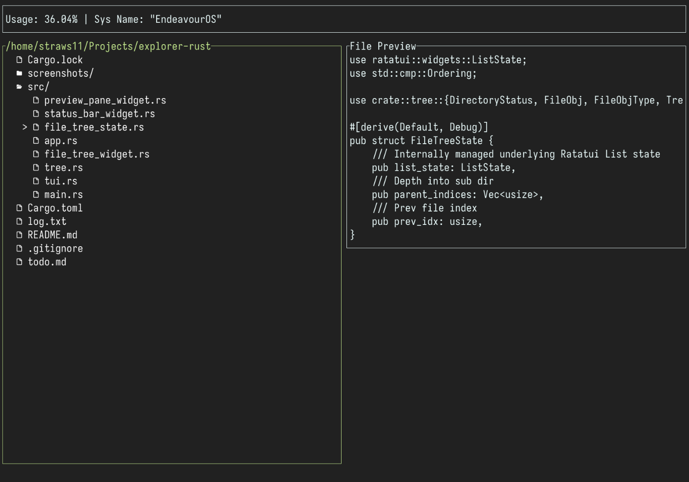

# TUI (Text based User Interface) File Explorer in Rust

For those who love staying in the terminal but want to navigate and manipulate files better than spamming `ls` and `cd`. Built in Rust using [Ratatui](https://www.ratatui.rs).

## Screenshots

## Features

- All keybinds are Vim inspired
- Move up and down the contents of current directory using `j` and `k`
- Move into the selected directory using `l`
- Move out of the current directory using `h`
- View/hide contents of a selected directory using `<Space>`
- View shifts into a higher directory when moving out of the currently displayed root
- View zooms into a directory when navigating deeper into a subdirectory
- Force view shift/zoom using `H` and `L`
- File preview on the right pane

## Future Features

- Copy/paste/cut/delete using familiar Vim motions
- Rename selected file/directory
- Multi-select to mass copy/paste/cut/delete
- Open selected file / directory in a chosen editor (catered for vim)
- Fuzzy find search for files

